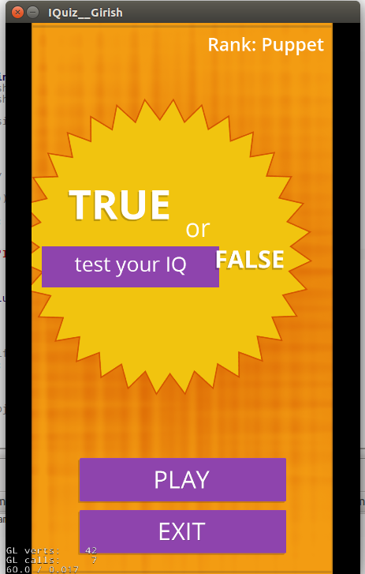

 <b><h3>IQ Quiz Cocos2dx Game </h3> </b>

This is a Simple my task I was completed.

This task serves for me to improve my c++ skills, learn cross-platform programming with cmake, 
as well as putting in audio and animations. First of all I want to improve my skills and hopefully the result will be a game that everyone is welcome to play and to just have fun with it.

<b> Requirements on Linux : </b>

* CMake
* cocos3dx developement library
* make developement library

<b> Compile and Run </b>

	Steps: go to project folder the make directory "build"
	       then go to that directory open command prompt and fire commads
	
	-> cmake ..
	-> make 
	
<table>
<tr>
<td></td>
</tr>
</table>

